# Автотесты разработаны для [Web BonSeller](https://seller.bonpass.com/) 


BonSeller
- это один из сервисов CRM системы [BonPass](https://bonpass.com/)
- это веб приложение для кассиров ( оформление продаж с учетом настроенной в CRM программы лояльности, скидок и акций)
## Тестовое покрытие:

- [x] UI тесты на проверку авторизации и навигации на странице [BonSeller](https://seller.bonpass.com/login)
  - задача [JIRA] (https://jira.autotests.cloud/browse/HOMEWORK-370)
<p align="center">
  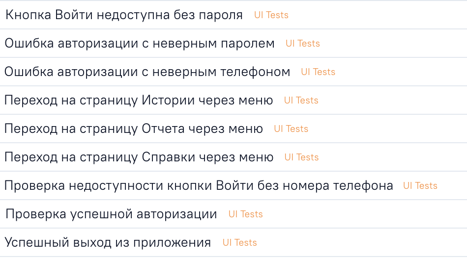
</p>
- [x] API тесты на регрес проверку базовых методов работы приложения
  - задача [JIRA] (https://jira.autotests.cloud/browse/HOMEWORK-366)
<p align="center">
  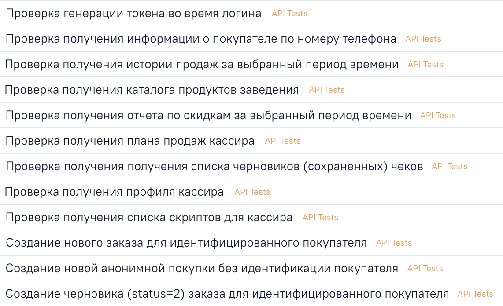
</p>
- [x] Ручные тесты проверки верстки приложения и тестов на основе динамических кодов подтверждения
  - задача [JIRA] (https://jira.autotests.cloud/browse/HOMEWORK-367)
<p align="center">
  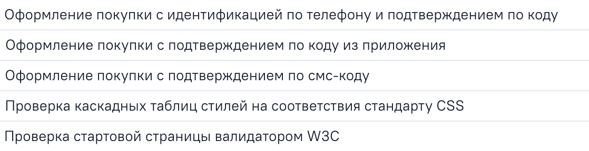
</p>

## Технологии и инструменты

<p  align="center">

<code></code>
<code></code>
<code></code>
<code></code>
<code></code>
<code></code>
<code></code>
<code></code>
<code></code>
<code></code>
<code></code>
</p>

* [Java](https://www.oracle.com/java/) - для написания тестов
* [Gradle](https://gradle.org) - для сборки проекта
* [JUnit 5](https://junit.org/junit5/) - для запуска тестов
* [Selenide](https://selenide.org) - для тестирования UI
* [Rest-Assured](https://rest-assured.io) - для тестирования API
* [Jenkins](https://www.jenkins.io/) - для обеспечения процесса непрерывной интеграции
* [Selenoid](https://aerokube.com/selenoid/) - для запуска UI тестов в [Docker containers](https://www.docker.com/resources/what-container)
* [Allure TestOps](https://docs.qameta.io/allure-testops/) и [Allure Report](http://allure.qatools.ru) - для управления тестами, анализа их прохождения и оформления отчетности
* [Jira](https://www.atlassian.com/software/jira) - для отслеживания задач
* [Telegram Bot](https://core.telegram.org/bots) - для оповещения о прохождении тестов
* ## Запуск и прохождение тестов:

### Локальный запуск тестов:

```
gradle clean test 
```
##  Запуск тестов в [Jenkins](https://jenkins.autotests.cloud/job/010-AzoLayza-HW25/build?delay=0sec)

### :pushpin: Параметры сборки

Параметры для запуска:
- BROWSER (по умолчанию chrome)
- BROWSER_VERSION (по умолчанию 100.0)
- BROWSER_SIZE (по умолчанию 1920x1080)
- REMOTE_DRIVER_URL (url-адрес selenoid, по умолчанию selenoid.autotests.cloud)
- TREADS (по умолчанию 1)

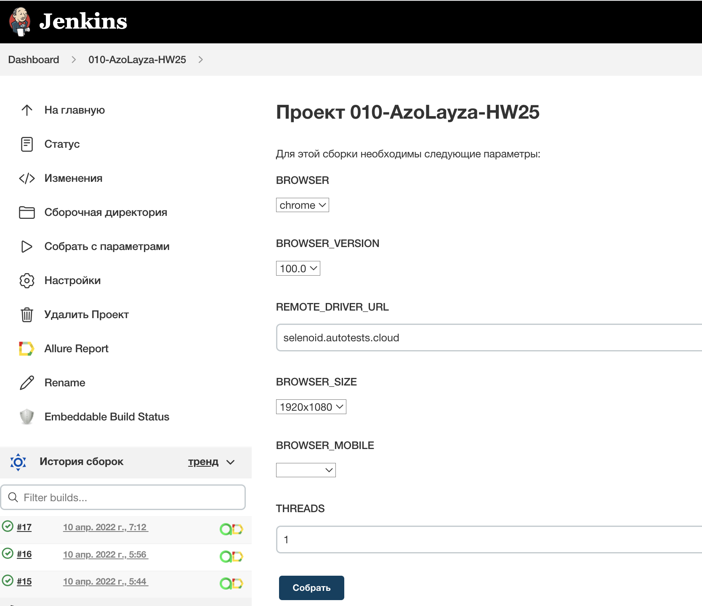

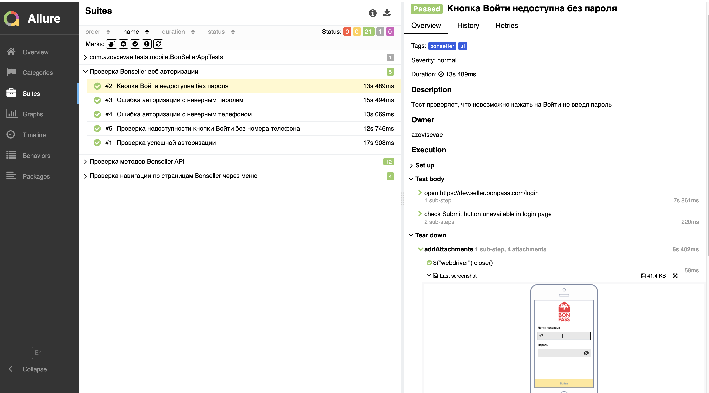

### Видео-отчет о прохождении теста из Selenoid:
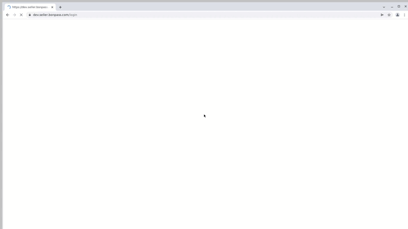

##  Отчет о результатах тестирования в [Allure Report](https://jenkins.autotests.cloud/job/010-AzoLayza-HW25/17/allure/)

### :pushpin: Общая информация

*Главная страница Allure-отчета содержит следующие информационные блоки:*

>- [x] <code><strong>*ALLURE REPORT*</strong></code> - отображает дату и время прохождения теста, общее количество прогнанных кейсов, а также диаграмму с указанием процента и количества успешных, упавших и сломавшихся в процессе выполнения тестов
>- [x] <code><strong>*TREND*</strong></code> - отображает тренд прохождения тестов от сборки к сборке
>- [x] <code><strong>*SUITES*</strong></code> - отображает распределение результатов тестов по тестовым наборам
>- [x] <code><strong>*ENVIRONMENT*</strong></code> - отображает тестовое окружение, на котором запускались тесты (в данном случае информация не задана)
>- [x] <code><strong>*CATEGORIES*</strong></code> - отображает распределение неуспешно прошедших тестов по видам дефектов
>- [x] <code><strong>*FEATURES BY STORIES*</strong></code> - отображает распределение тестов по функционалу, который они проверяют
>- [x] <code><strong>*EXECUTORS*</strong></code> - отображает исполнителя текущей сборки (ссылка на сборку в Jenkins)

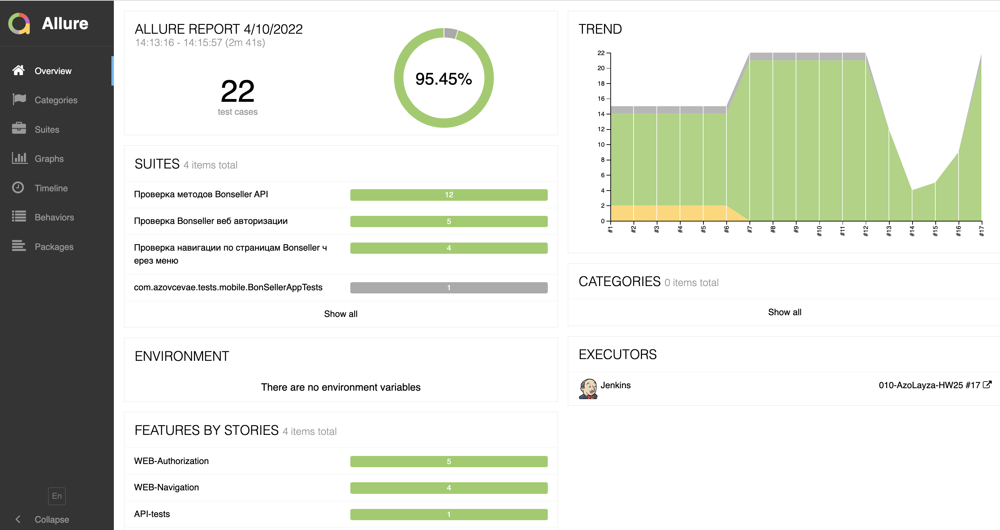

##  Интеграция с [Allure TestOps](https://allure.autotests.cloud/project/1222/dashboards/)

### :pushpin: Основной дашборд

<p align="center">
  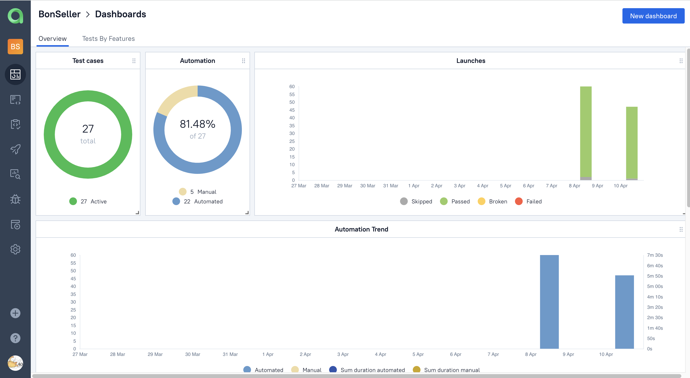
</p>

### :pushpin: Запуски

<p align="center">
  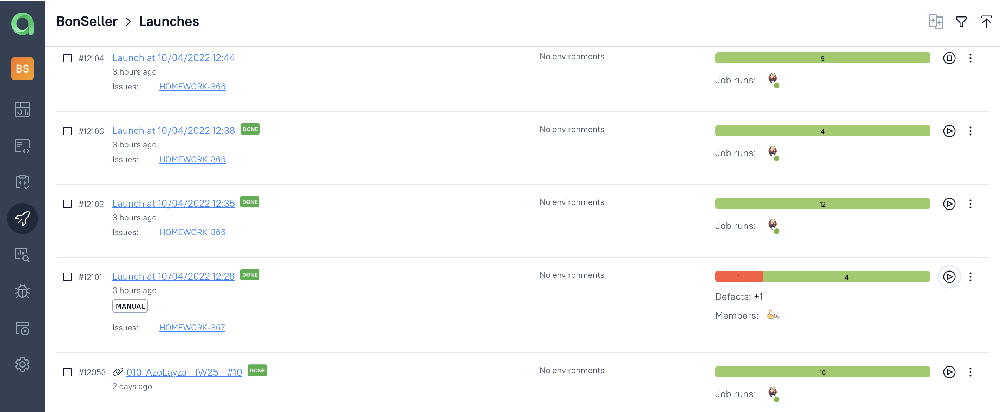
</p>

### :pushpin: Тест-кейсы

<p align="center">
  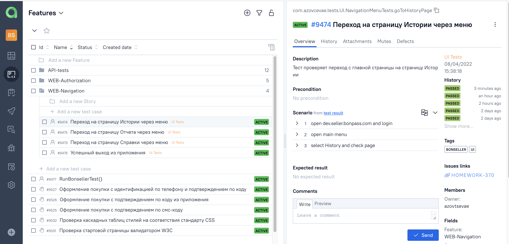
</p>

### :pushpin: Обнаруженные ошибки (Defects)

<p align="center">
  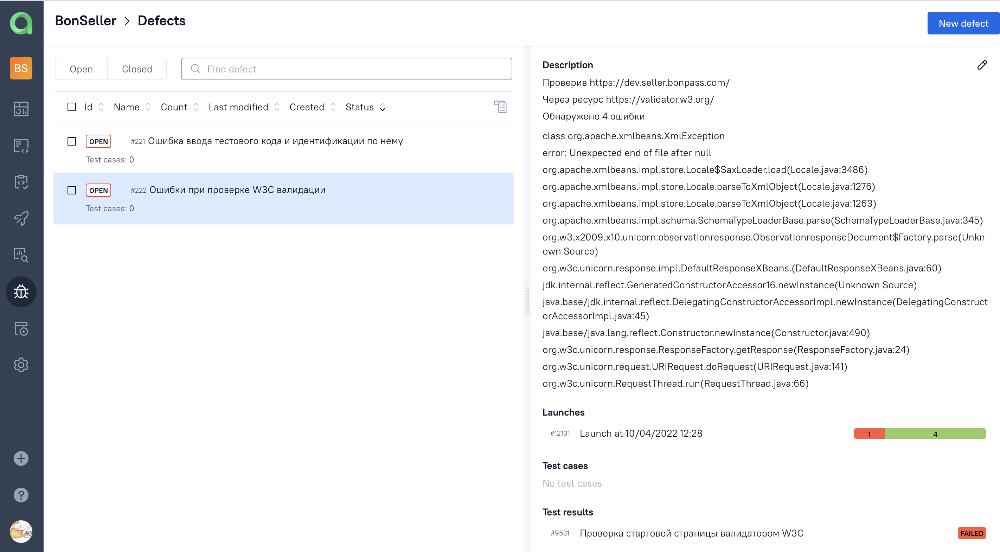
</p>

##  Интеграция с [Jira](https://jira.autotests.cloud/browse/HOMEWORK-269)

<p align="center">
  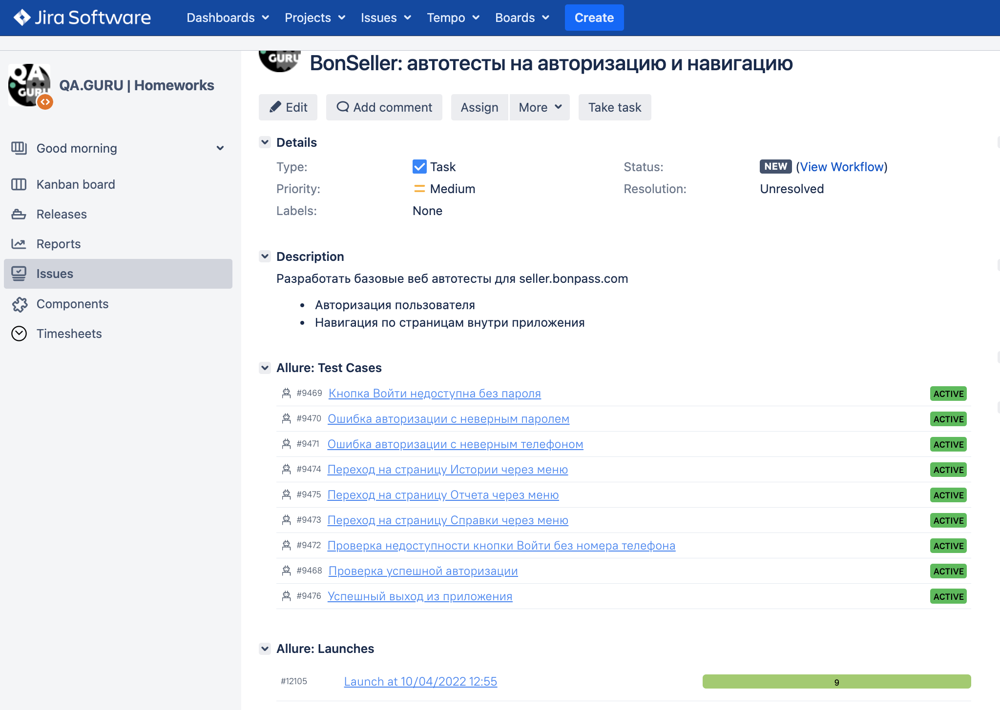
</p>

##  Уведомления в Telegram

<p align="center">
  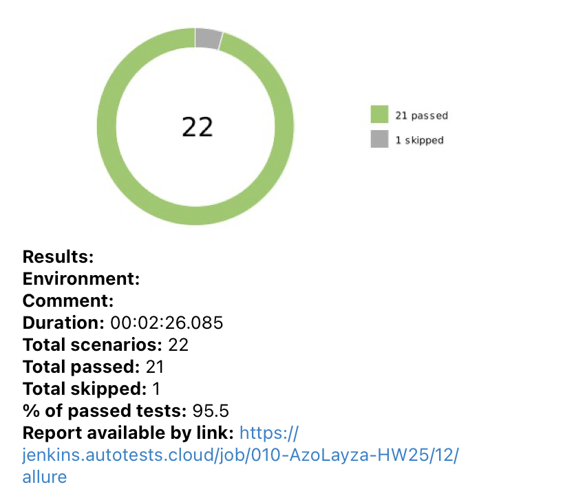
</p>

## Контакты
[](https://github.com/azolayza)
[](https://t.me/azolayza) 